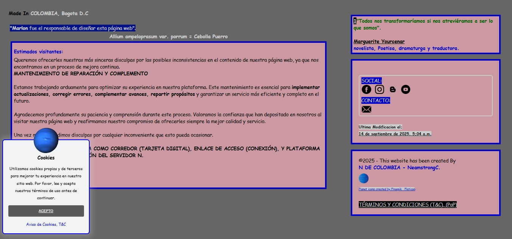
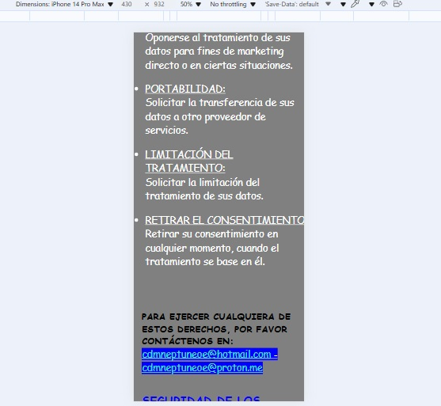
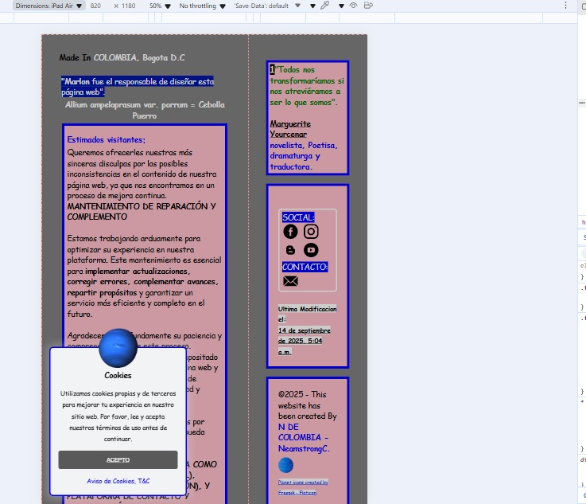
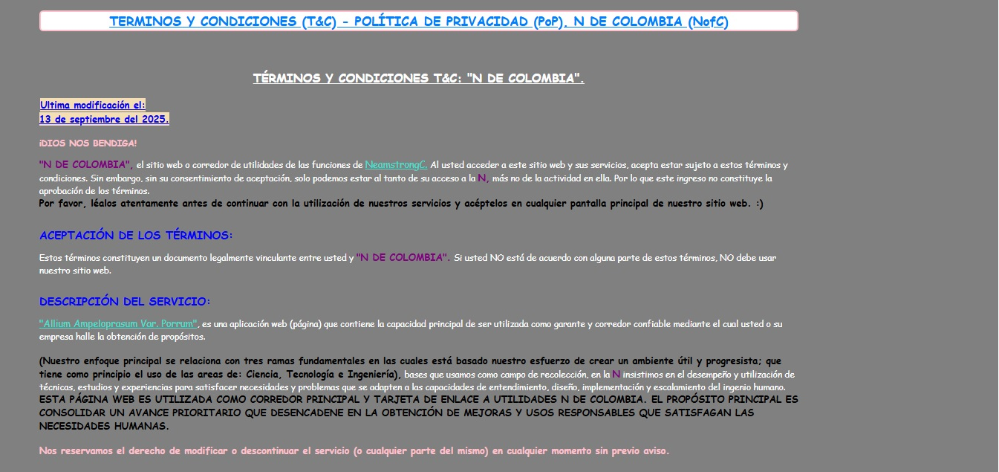
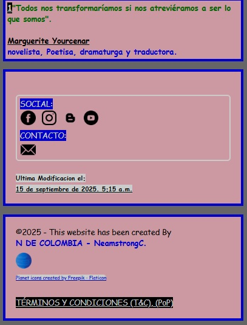
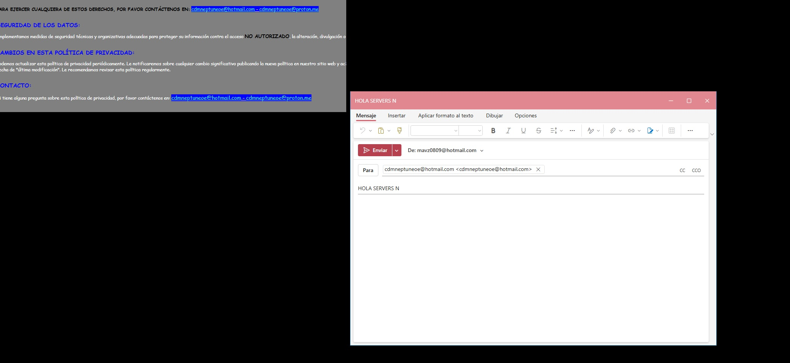
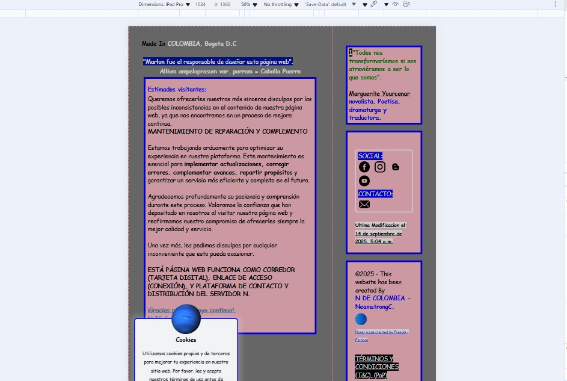

#PÁGINA PRINCIPAL#

## [1.3.1] 

-   PROGRAMA WEB (PÁGINA) CON FUNCIÓN DE TARJETA DIGITAL PERSONALIZADA Y DISEÑADA POR: (@NeamstrongC - N DE COLOMBIA), A MODO DE COMPATIBILIDAD RESPONSIVA Y DE ACCESIBILIDAD MULTIPLE INCORPORANDO ESTRATEGIAS Y DISTINTOS MECANISMOS DE PROYECCIÓN, PROTECCIÓN Y EVOLUCIÓN.

#COOKIES RESPONSIVE#

#RESPONSIVE PÁGINA PRINCIPAL#

-   ESTE PROYECTO ES UTILIZADO COMO EMERGENTE DE PUBLICIDAD Y DE REPARTICIÓN DEL PROPÓSITO DE AVANCE CONTINUO PARA LOGRAR LA EVOLUCION POSITIVA HACIA LOS ASPECTOS QUE MEJOREN LA CONDICION DE LA HUMANIDAD. :)

-   ESTA TARJETA INCLUYE ADEMÁS DE MI DESCRIPCIÓN COMO PERSONAJE COLOMBIANO QUE BUSCA CREAR UN ENTORNO DE HUELLAS INOLVIDABLES Y QUE LLENEN DE VALOR LA DISCIPLINA Y LA COHERENCIA. Los READ.me en la mayoria de repositorios publicos que contiene el servido N. (SON NOTAS N)
(Y QUE ESTA PRESENTE EN LA PARTE ALTA DE ESTE ARCHIVO).

-   YA HABIENDO INCLUIDO LOS RESPECTIVOS DETALLES Y COMPLEMENTOS QUE HACEN LEGAL Y VINCULANTE EL DOCUMENTO DE POLÍTICA DE PRIVACIDAD Y LAS CONDICIONES DE USO. SE PROCEDE A MINIMIZAR LA CANTIDAD DE INSTRUCCIONES HACIA EL SERVIDOR, POR LO QUE INMEDIATAMENTE SE INSTRUYE CORRECTAMENTE EL ETIQUETADO DE HTML CON EL ESTILO EN CSS PARA MINIMIZAAR LA INSTRUCCION.

#TÉRMINOS Y CONDICIONES, POLÍTICA DE PRIVACIDAD#

-   PARA N (NeamstrongC - Marlon Andres Vasquez Zea). Comenzar con su construcción edificadora del cohete colombiano que despegara hacia cualquier lugar del mundo donde haya una base de despegue espacial. debiamos tener principalmente terminado nuestro corredor para ser utilizado como mediador que ofrezca garantia y seguridad hacia lo que llamamos OBJETIVO.  La primera parte de poder tener algo autonomo nos hizo reflexionar en la base principal de nuestra idea la cual se basa en la inclusión, desarrollo y potenciacion de las ideas ajenas.

## [2.0.1]

-   VERSION DONDE SE ACLARA Y SE REMARCA QUE (NO) DEBE HACER LAS COSAS MAL HECHAS. SINO DEBE HACER BIEN LAS COSAS.

-   ACOMPAÑAMOS NUESTRA PÁGINA PRINCIPAL DE DETALLES MOTIVACIONALES Y QUE SIRVAN PARA CONECTAR DE ALGUNA MANERA CON LA PERSONA QUE SE CONECTA A NOSOTROS. ES RECIPROCIDAD.

#APARTADO DE FRASE Y BOTÓNES#

-   SEGUIMOS INSISTIENDO EN LA APLICACIÓN DE IDEAS Y OCURRENCIAS CON ORDEN. DESCUBRIMOS QUE EL PRINCIPAL MEDIO PARA LLEGAR ES NUESTRA IMAGINACIÓN.
DE AHI HACIA ADELANTE OJALA NADA NOS PARE.

-   TIRAMOS LA N DE COLOMBIA POR DELANTE DE TODO PARA QUE VEAN QUE PORQUE TIENE UN NOMBRE PROPIO NO ES INDIVIDUAL. is FOR alls

-   SE IMPLEMENTA UNA NUEVA REDUCCIÓN DE ARCHIVO E INSTRUCCIONES CSS PARA UNIFICAR MEDIDAS, COMPLETAMOS BOTONES PARA REDIRECCIONAR A SITIOS SUGERIDOS Y CULPABLEMENTE ÚTILES PARA SU VIDA Y LA DEL QUE QUIERA, ESTO INCLUYE LOS MENSAJES PROGRAMADOS HACIA LAS SECCIONES DE CONTACTO, TERMINOS Y CONDICIONES, POLITICA DE PRIVACIDAD, Y DEMAS PREGUNTAS QUE PUEDAN APLICAR.

#MENSAJE EMAIL PROGRAMADO#

-   UNA VEZ TENGAMOS COMPLETAMENTE LISTO NUESTRO PROGRAMA WEB. EL PROYECTO POR DONDE EMPIEZA LA N. 
LA IDEA QUE SIGUE ES DESARROLLAR MEJORAS Y COMPLEMENTAR TODO LO QUE ESTE A NUESTRO ALCANCE Y DISPOSICION DE ALTRUISMO. PASAMOS A CONSEGUIR PERSONAS QUE ADEMAS DE CONTACTO, NOS BRINDEN EL ACOMPAÑAMIENTO DE: CLIENTES, SOCIOS, BENEFICIARIOS, APOYADORES, INVERSORES Y GERENTES DEL BIENESTAR COLECTIVO QUE PROMUEVE LA N.

#ERROR DE COOKIES#

-   
